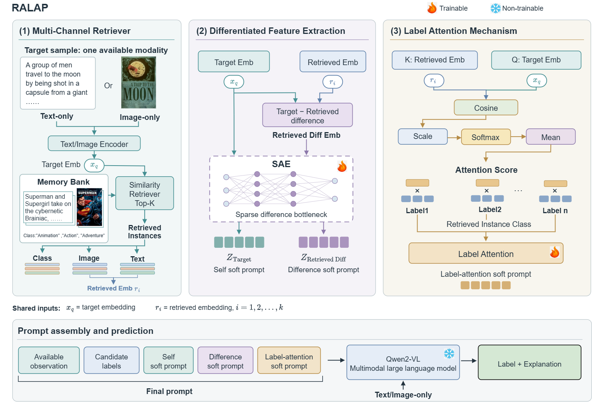

# Retrieval-Augmented Label-Attention Prompt Learning (RALAP)

This repository provides the research code for **Retrieval-Augmented Label-Attentive Prompt Learning for Multimodal Classification with Missing Modalities (RALAP)**. RALAP uses retrieved complete multimodal samples as evidence to form dynamic soft prompts for a frozen Qwen2-VL model.

## Abstract

Missing modalities make multimodal classifiers brittle because the available evidence is partial, while common remedies either synthesize the missing modality or rely on static missing-aware prompts. We argue that missing-modality classification should instead be treated as retrieval-augmented evidence selection: a memory bank can provide useful neighbors, but the retrieved labels and embeddings are noisy and should not be trusted uniformly.  We introduce Retrieval-Augmented label-attentive prompt Learning for Multimodal Classification with Missing Modalities (RALAP), a frozen-LLM framework that converts retrieved multimodal neighbors into dynamic soft prompts. RALAP first encodes the target self-embeddings and target--neighbor difference embeddings through a sparse autoencoder bottleneck to generate differential soft prompts. It then computes a label-attentive prompt by weighting retrieved instances with a similarity kernel and aggregating their labels into a target conditioned label prior. The resulting self, difference, and label prompts are injected into a frozen Qwen2-VL model, which jointly generates a class label and a short explanation. We further show theoretically that, with sufficient retrieval coverage and stronger aggregated evidence for ground-truth labels than distractors, ground-truth labels receive higher attention scores. Empirically, the results support the need for target conditioned reweighting and are consistent with the theoretical behavior of label attention. RALAP-VLM achieves the best reported performance in 10 of 12 evaluation settings across MM-IMDb, HateMemes, and Food101, with a maximum observed improvement of 20.52 percentage points on MM-IMDb. These results support the effectiveness of combining retrieval-enhanced sparse differential prompts with target conditioned label-attentive prompts under modality missingness.

## Framework



1. A retrieval module selects complete multimodal neighbors from a dataset-specific memory bank.
2. A sparse autoencoder bottleneck maps self and target-neighbor difference embeddings to differential soft prompts; a similarity-kernel label-attention module aggregates retrieved labels into a label prompt.
3. The resulting prompts are injected into a frozen Qwen2-VL backbone, which generates a class label and a short explanation.

## Repository Layout

```text
RALAP/
|-- config/config.yaml              # Dataset selection and data configuration
|-- init_dataRAGPT.py               # Raw metadata -> splits, memory bank, retrieval results
|-- core_toolsRAGPT.py              # Dataset initialization and retrieval implementation
|-- create-dataset.py               # Retrieval records -> Hugging Face datasets
|-- model-train.py                  # Training entry point
|-- model-eval.py                   # Inference and evaluation entry point
|-- model/                          # RALAP model and prompt modules
|-- data/                           # Dataset-to-prompt conversion
|-- utils/                          # Collation, tokenization, templates, utilities
|-- deepspeed/                      # DeepSpeed configuration
|-- run-create.sh                   # Dataset-construction launcher
|-- run-train.sh                    # Training launcher
|-- run-eval.sh                     # Inference and evaluation launcher
|-- requirements.txt                # Python dependencies
`-- fig/method_framework.pdf        # Method overview
```

Raw datasets, generated retrieval features, model checkpoints, and evaluation outputs are not included in this repository.

## Environment Setup

The experiments use a Conda environment named `RALAP` with Python 3.11:

```bash
conda create -n dep python=3.11 -y
conda activate RALAP
pip install -r requirements.txt
```

PyTorch, DeepSpeed, and optional attention packages are CUDA- and platform-sensitive. Install a PyTorch build compatible with the host CUDA runtime and GPU before running the experiments. The training launcher defaults to PyTorch SDPA; verify the installed DeepSpeed and CUDA toolchain on the target machine.

Run commands from the repository root (RALAP/). The data initialization and retrieval implementation currently read raw files from repository-relative dataset/ paths. Place or link the downloaded data at RALAP/dataset/ before running initialization. 

## Data Preparation

Download the datasets from their original sources and arrange the files as follows. Do not upload raw images, metadata, or derived data to the code repository.

```text
RALAP/
`-- dataset/
    |-- mmimdb/
    |   |-- image/<item_id>.<jpg|jpeg|png>
    |   `-- meta_data/
    |       |-- split.json
    |       `-- <item_id>.json
    |-- hatememes/
    |   |-- image/<zero-padded_id>.png
    |   `-- meta_data/
    |       |-- train.jsonl
    |       |-- dev.jsonl
    |       `-- test_seen.jsonl
    `-- food101/
        |-- image/<item_id>.<jpg|jpeg|png>
        `-- meta_data/
            |-- class_idx.json
            |-- train_titles.csv
            `-- test_titles.csv
```

### MM-IMDb

Download [MM-IMDb](https://archive.org/download/mmimdb/mmimdb.tar.gz). Place the raw images in dataset/mmimdb/image/ and the split file plus per-item JSON metadata in dataset/mmimdb/meta_data/. Image filenames must correspond to the sample IDs in the metadata.

### HateMemes

Download the [Facebook Hateful Meme Dataset](https://www.kaggle.com/datasets/parthplc/facebook-hateful-meme-dataset). The code expects the metadata directory to be named meta_data and the split files to be JSON Lines: train.jsonl and dev.jsonl.

For labeled test evaluation, use the test_seen data from [this Kaggle dataset](https://www.kaggle.com/datasets/williamberrios/hateful-memes), not the unlabeled test split in the first download. The initializer reads dataset/hatememes/meta_data/test_seen.jsonl. If the downloaded labeled file is named test_seen.json, rename that file to test_seen.jsonl without changing its records; keep the other metadata files unchanged. Ensure it contains one JSON record per line.

### Food101

Download [UPMC Food101](https://www.kaggle.com/datasets/gianmarco96/upmcfood101). Place the raw images in dataset/food101/image/ and train_titles.csv, test_titles.csv, and class_idx.json in dataset/food101/meta_data/. The initializer also accepts class_idx.json directly under dataset/food101/.

The image directory should contain image files named by sample ID, for example dataset/food101/image/<item_id>.jpg.

## Code Running

The examples below use MM-IMDb. Replace mmimdb with hatememes or food101 as needed.

### 1. Initialize Raw Data and Retrieval

Select the dataset in config/config.yaml:

```yaml
data_para:
  dataset_name: "mmimdb" # mmimdb, food101, hatememes
```

Then initialize dataset splits, generate memory-bank features, and compute retrieval results:

```bash
python init_dataRAGPT.py
```

This stage creates split pickle files, builds the text and image memory bank, and adds retrieved-neighbor information to the splits. It may download the ViLT feature extractor and requires the corresponding model files to be available.

### 2. Build LLM Training Data

```bash
RALAP_DATASET_NAME=mmimdb \
PROMPT_TOKEN_COUNT=5 \
HF_DATA_OUTPUT_ROOT=data/data_k5_mmimdb \
./run-create.sh
```

The launcher saves Hugging Face datasets under data/data_k5_mmimdb/dataset_train, dataset_val, and dataset_test, and creates the prompt tokenizer under output/DEP-tokenizer. If retrieval columns are absent, create-dataset.py attempts to initialize retrieval data automatically; the explicit initialization step above is recommended.

### 3. Train

```bash
PROMPT_TOKEN_COUNT=5 \
LABEL_LOSS_WEIGHT=0.8 \
TRAIN_DATA_DIR=data/data_k5_mmimdb/dataset_train \
./run-train.sh
```

Change OUTPUT_DIR, GPU selection, and MASTER_PORT to match the machine and experiment. The launcher uses deepspeed/ds_z2_frozen_config.json by default and writes checkpoints under OUTPUT_DIR.

### 4. Evaluate

Point MODEL_PATH to a trained checkpoint and EVAL_DATA_DIR to the saved test dataset:

```bash
RALAP_DATASET_NAME=mmimdb \
MODEL_PATH=/path/to/checkpoint \
TOKENIZER_PATH=output/DEP-tokenizer \
PROMPT_TOKEN_COUNT=5 \
EVAL_DATA_DIR=data/data_k5_mmimdb/dataset_test \
./run-eval.sh
```

run-eval.sh runs inference and then computes metrics. The primary metric is selected by dataset: multilabel metrics for MM-IMDb, AUROC for HateMemes, and accuracy for Food101. Set EVAL_LIMIT=100 for a limited evaluation run. The checkpoint, tokenizer, prompt-token count, and embedding dimension must match the training run.

### 5. DSP Ablations

Use DSP_ABLATION_MODE to select which dynamic soft-prompt components are active. Keep EVAL_ABLATION_MODE=none for these DSP-only ablations. Replace the checkpoint and data paths as appropriate:

```bash
# Sparse-autoencoder differential prompts only
DSP_ABLATION_MODE=sae_only RALAP_DATASET_NAME=mmimdb \
MODEL_PATH=/path/to/checkpoint TOKENIZER_PATH=output/DEP-tokenizer \
PROMPT_TOKEN_COUNT=5 EVAL_DATA_DIR=data/data_k5_mmimdb/dataset_test \
./run-eval.sh

# Label-attention prompt only
DSP_ABLATION_MODE=label_only RALAP_DATASET_NAME=mmimdb \
MODEL_PATH=/path/to/checkpoint TOKENIZER_PATH=output/DEP-tokenizer \
PROMPT_TOKEN_COUNT=5 EVAL_DATA_DIR=data/data_k7_mmimdb/dataset_test \
./run-eval.sh

# Disable both DSP components
DSP_ABLATION_MODE=no_dsp RALAP_DATASET_NAME=mmimdb \
MODEL_PATH=/path/to/checkpoint TOKENIZER_PATH=output/DEP-tokenizer \
PROMPT_TOKEN_COUNT=5 EVAL_DATA_DIR=data/data_k7_mmimdb/dataset_test \
./run-eval.sh
```

The evaluator also supports input/modality ablations through EVAL_ABLATION_MODE; do not combine a non-default input ablation with a DSP ablation because the implementation disallows combining these modes.

## Reproducibility Notes

- The default language model is Qwen/Qwen2-VL-7B-Instruct; the retrieval feature extractor uses dandelin/vilt-b32-mlm. Make both model assets available to the environment before running the corresponding stages.
- RALAP_DATASET_NAME selects the dataset for dataset construction, training metadata, and evaluation. Raw data initialization selects it through data_para.dataset_name in config/config.yaml.

## Citation

Citation information for the RALAP paper will be added when the manuscript is available.
